# Online Compiler

[](https://github.com/AlexMaster168/online-compiler/actions/workflows/ci.yml)
[](https://github.com/AlexMaster168/online-compiler/actions/workflows/nightly.yml)

Онлайн-компилятор на Django + PostgreSQL с собственным движком исполнения (без Judge0, Piston и прочих готовых API).

Пиши обычный код, собирай программы из блоков, создавай проекты Scratch со сценой и спрайтами
или запускай прошивки микроконтроллеров. Код исполняется нашим сервером и локальными Docker-образами;
Arduino эмулируется прямо в браузере, ESP32 — в QEMU.

**Навигация:** [быстрый старт](#быстрый-старт) · [первый проект](#первый-проект) ·
[алгоритмы](#библиотека-алгоритмов) · [Scratch и блоки](#блоки-и-scratch-3) ·
[Arduino](#arduino-uno) · [ESP32](#esp32-и-сайт-внутри-прошивки) ·
[аккаунты](#аккаунты-и-сохранение-проектов) · [решение-проблем](#если-что-то-не-запускается)

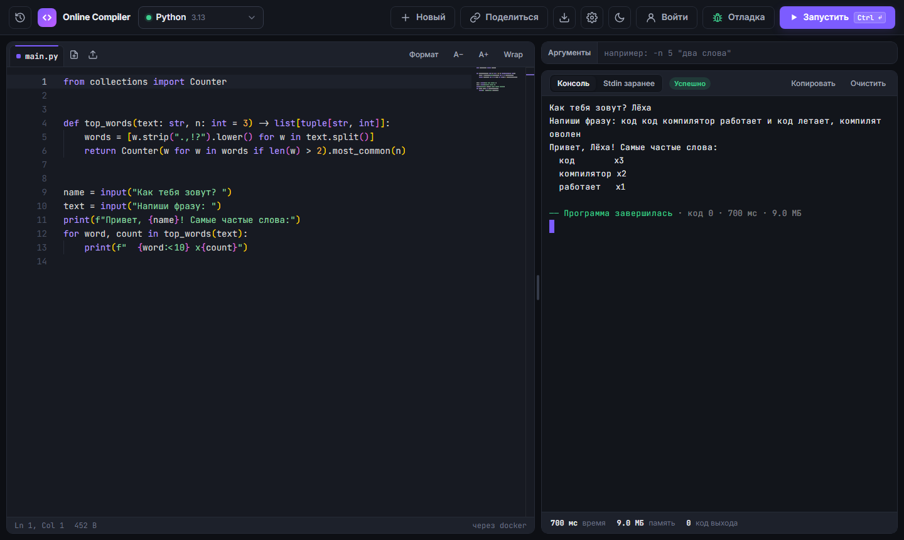

- **41 язык**: Python, JavaScript, TypeScript, C, C++, Java, C#, Go, Rust, Kotlin, Ruby, PHP, Perl, Lua, Bash, Haskell,
  Swift, R, Dart, Elixir, SQL (SQLite), Pascal, Fortran, Assembly (NASM x86-64), Prolog, Visual Basic .NET, Objective-C,
  Scala, F#, OCaml, Erlang, Clojure, Julia, Zig, Nim, Crystal, D, COBOL, Ada, Common Lisp, Groovy
- **Библиотека алгоритмов** — кнопка «Примеры»: 15 задач (сортировки, бинарный поиск, решето, НОД, Фибоначчи,
  быстрое возведение в степень, BFS, DFS, Дейкстра, LCS, рюкзак, Ханойские башни) на **каждом** из 41 языка —
  615 сниппетов, и каждый автоматически сверяется с эталонным выводом
- **Monaco Editor** (движок VS Code): подсветка, автодополнение, мини-карта, sticky scroll
- **Blockly и Scratch 3**: блоки → Python либо полный редактор со сценой, спрайтами и сохранением .sb3
- **Arduino Uno и ESP32**: настоящая сборка прошивок, визуальные компоненты Uno, Serial и сайт на ESP32 в QEMU
- Ошибки компилятора/трейсбеки подсвечиваются **прямо в коде**, а `main.c:12` в выводе — кликабельная ссылка на строку
- stdin, история запусков (по сессии), шаринг по короткой ссылке `/s/<id>/`, тёмная и светлая тема, черновики по языкам, ресайз панелей, мобильная вёрстка
- **Интерактивная консоль** как в OnlineGDB: программа спрашивает — ты отвечаешь прямо в терминале (xterm.js + WebSocket).
  В Docker программа работает в настоящем PTY: приглашения без `\n` видны сразу, `Ctrl+C` — SIGINT, `Ctrl+D` — конец ввода.
  Режим «Stdin заранее» (stdout/stderr раздельно) тоже остался
- **Отладчик** для 7 языков: брейкпоинты, шаги, стек, переменные, watch, значения при наведении
- **Мультифайловые проекты**: вкладки, новый файл (`Alt+N`), переименование двойным кликом, загрузка с диска и drag&drop
- **Аргументы командной строки** (`argv`, `sys.argv`, `os.Args`…) — строкой как в шелле, работают и в консоли, и в отладчике
- **Beautify** (`Shift+Alt+F`): настоящие форматтеры в браузере через WASM — ruff (Python), clang-format
  (C/C++/Java/C#), biome (JS/TS), gofmt, sql, lua, shfmt, dart; Rust (`rustfmt`) и Elixir (`mix format`) — на сервере в песочнице
- **Скачать проект** одним `.zip` (и `/s/<id>/zip/` для сниппета)
- **Настройки редактора**: раскладка Vim / Emacs, пробелы или табы, ширина отступа, шрифт, перенос, миникарта, стиль clang-format
- **Аккаунты и «Мои проекты»**: регистрация, вход; `Ctrl+S` сохраняет свой проект на месте (ссылка не меняется),
  чужой — форкает к тебе вместе с твоими правками; поиск, переименование, удаление; история запусков — общая для всех
  устройств. Без аккаунта всё работает как раньше: `Ctrl+S` даёт анонимную неизменяемую ссылку
- Горячие клавиши: `Ctrl+Enter` — запуск / стоп, `Ctrl+S` — сохранить / поделиться, `Shift+Alt+F` — форматировать

## Скриншоты

**Отладчик** — брейкпоинт в цикле, стек вызовов, локальные переменные и watch-выражение (C через gdbserver + GDB DAP):

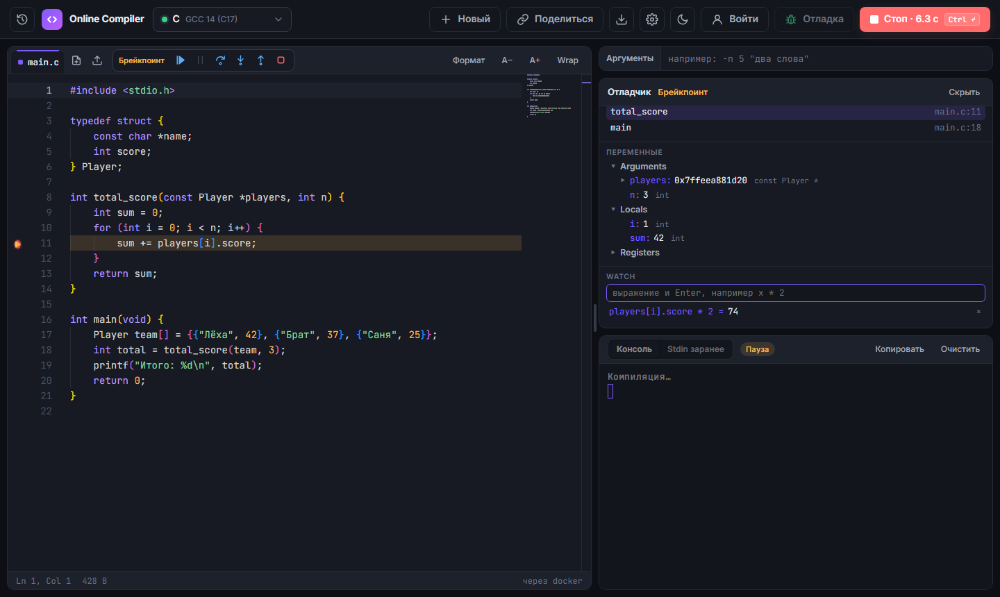

**Мультифайловый проект и ошибки в коде** — ошибка компилятора подчёркнута прямо в строке, `main.cpp:6:49` в выводе
кликабельна; светлая тема и режим «Stdin заранее»:

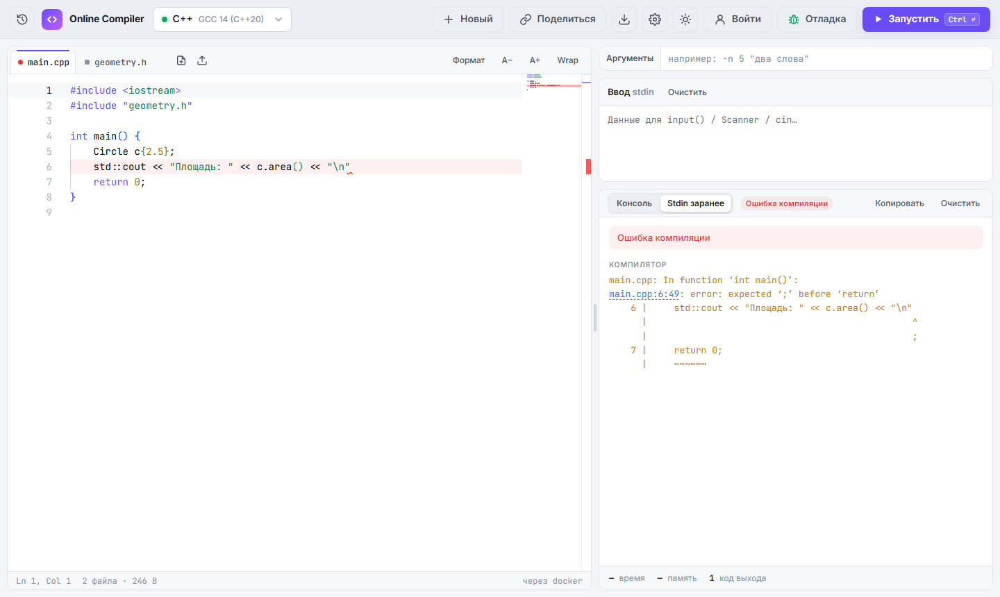

**Beautify, аргументы командной строки и Vim** — Rust отформатирован `rustfmt`, аргументы ушли в `std::env::args()`,
внизу строка режима Vim:

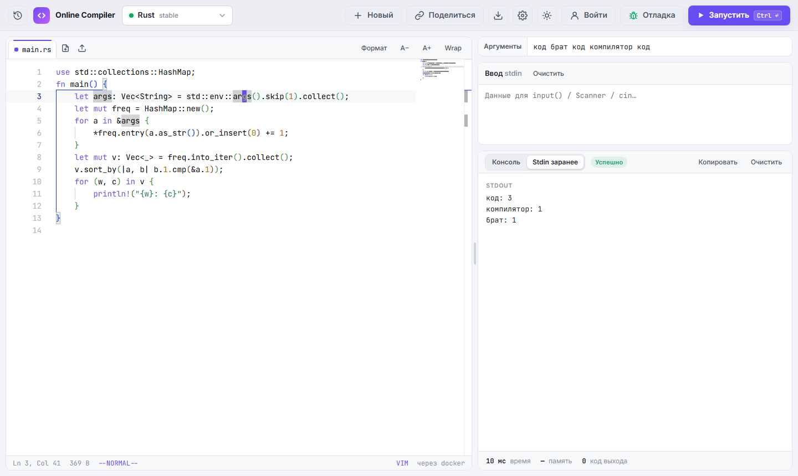

**«Мои проекты»** — проект в шапке, поиск по своим проектам:

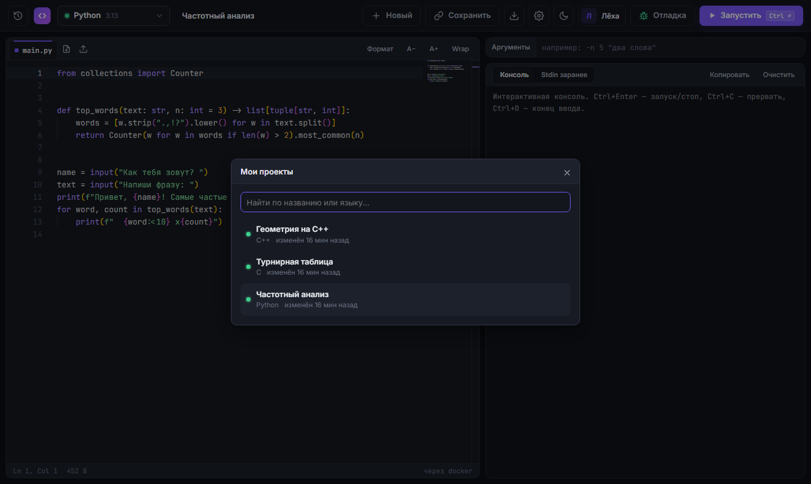

| Настройки редактора | Телефон |
|---|---|
| 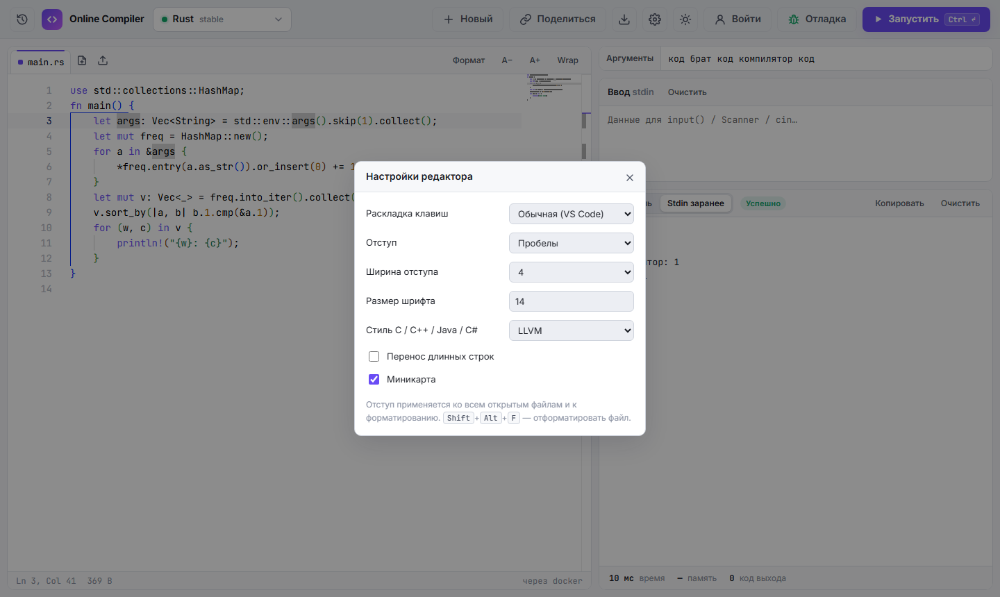 | 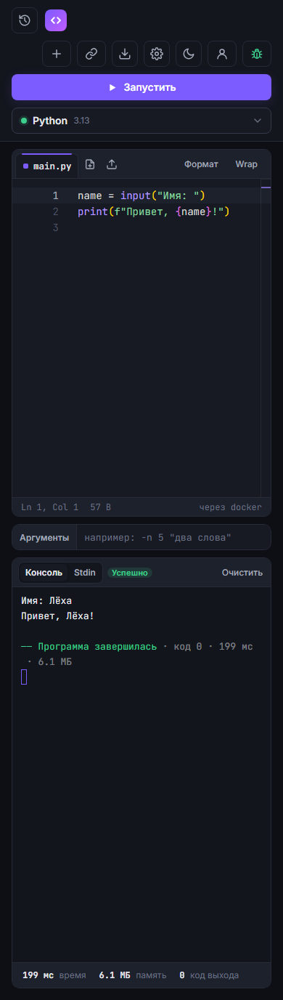 |

Скриншоты снимаются автоматически: `python e2e\screenshots.py` (нужны запущенный сервер, Docker и `build_sandbox`).

## Быстрый старт

Двойной клик по **`start.bat`** — он сам создаст venv, поставит зависимости, накатит миграции, разбудит Docker
и откроет браузер (`start.bat 9000` — другой порт). Вручную:

```powershell
python -m venv .venv
.\.venv\Scripts\pip install -r requirements.txt
copy .env.example .env          # впиши DB_PASSWORD и DJANGO_SECRET_KEY
.\.venv\Scripts\python manage.py migrate
.\.venv\Scripts\python manage.py pull_images   # официальные образы языков (выборочно: pull_images python cpp go)
.\.venv\Scripts\python manage.py build_sandbox # свои образы: языки oc-lang-* (Pascal, COBOL, Zig, Scala…),
                                               # отладчики oc-debug-* и хелперы консоли (несколько ГБ)
.\.venv\Scripts\python manage.py runserver
```

Открой http://127.0.0.1:8000. Админка — `/admin/` (сначала `manage.py createsuperuser`).

`manage.py engine_status` показывает, какой язык через какой бэкенд пойдёт.

### Подготовка Scratch и плат

Редакторы и тулчейны устанавливаются один раз. Для сборки нужна сеть; повторные сборки используют кеш Docker.

```powershell
.\.venv\Scripts\python manage.py build_scratch          # полный редактор Scratch 3
.\.venv\Scripts\python manage.py build_sandbox arduino  # Arduino CLI, AVR, Servo, LiquidCrystal
.\.venv\Scripts\python manage.py build_sandbox esp32    # ESP-IDF и QEMU Espressif
```

Scratch собирается из исходников в `compiler/static/scratch/`: этот каталог не хранится в Git.
После клонирования репозитория собери редактор перед открытием `/scratch/`.
Blockly загружается в браузер при выборе **Блоки**; отдельная сборка ему не нужна.
Первичная загрузка ESP-IDF занимает несколько ГБ, поэтому оставь свободное место для Docker.

| Режим | Как открыть | Что запускает программу |
|---|---|---|
| Обычный код | главная страница, меню языков | собственный движок Docker / local |
| Блоки | меню языков → **Блоки** | Python, полученный из Blockly |
| Scratch 3 | меню языков → **Scratch 3**, `/scratch/` | Scratch VM в браузере |
| Arduino Uno | меню языков → **Arduino Uno**, `/arduino/` | AVR8js, прошивка ATmega328P |
| ESP32 | меню языков → **ESP32 · Serial** | ESP-IDF + QEMU в Docker |

## Первый проект

1. Выбери язык. В редакторе появится готовый стартовый пример.
2. Нажми **Запустить** или `Ctrl+Enter`.
3. Если программа читает ввод, отвечай в интерактивной консоли. Для заранее подготовленного ввода выбери **Stdin заранее**.
4. Добавляй файлы кнопкой нового файла, через `Alt+N`, загрузкой с диска или перетаскиванием.
5. Нажми `Ctrl+S`, чтобы сохранить проект в аккаунт или получить ссылку для обмена.

**Примеры** заменяют текущий проект выбранным алгоритмом. Если уже есть свой код,
редактор запросит подтверждение замены — сначала сохрани нужную версию.
Аргументы запуска задаются отдельной строкой: например, `--count 5 "два слова"`.

## Библиотека алгоритмов

615 готовых сниппетов: одни и те же 15 задач на каждом из 41 текстового языка.
Их удобно сравнивать между языками, менять входные данные и разбирать в отладчике.
Кнопка **Примеры** показывает категории и поиск по названию и описанию.

| Категория | Примеры |
|---|---|
| Сортировки | пузырьком, быстрая, слиянием |
| Поиск | бинарный поиск |
| Математика | решето Эратосфена, НОД/НОК, Фибоначчи, факториал, степень по модулю |
| Графы | BFS, DFS, алгоритм Дейкстры |
| Динамическое программирование | LCS, рюкзак |
| Рекурсия | Ханойские башни |

```powershell
.\.venv\Scripts\python manage.py check_library python cpp
.\.venv\Scripts\python manage.py check_library --algo dijkstra
```

В режиме ESP32 кнопка **Примеры** предлагает HTTP-сервер для эмулятора
и отдельный Wi-Fi пример для физической платы. Blockly и Scratch используют свои блоки.

## Как устроен движок (`compiler/engine/`)

| Файл | Что делает |
|---|---|
| `languages.py` | Реестр языков: имя файла, шаблон, команды сборки/запуска для Docker и для хоста |
| `docker.py` | Песочница: одноразовый контейнер на запуск |
| `local.py` | Запуск тулчейнами хоста (для разработки) |
| `process.py` | Процесс с лимитами: время, память, вывод, число процессов |
| `__init__.py` | Выбор бэкенда, валидация, ограничение параллельных запусков |
| `sandbox/lang/*.Dockerfile` | Свои образы языков: `extra` (Pascal, Fortran, NASM, Prolog, COBOL, Ada, Objective-C, Lisp, OCaml, D, Zig), `jvm` (Scala, Clojure) |

Библиотека алгоритмов — `compiler/library/`: код в `code/<язык>/<задача>.<расширение>`, эталонные выводы — в
`expected.json`, один на все языки. `manage.py check_library [языки] [--algo задача]` запускает сниппеты в песочнице
и сверяет вывод (у SQL — ячейки результата, а не рамки таблицы).

**Docker-бэкенд** (`EXECUTOR_BACKEND=docker`, или `auto`, если демон запущен): `--network none`, read-only rootfs,
`--cap-drop ALL`, `no-new-privileges`, пользователь `nobody`, лимиты памяти/CPU/pids/файлов, `timeout -s KILL`
внутри контейнера. Время и пиковая память замеряются внутри контейнера, без учёта старта Docker.

**Локальный бэкенд** (`EXECUTOR_BACKEND=local`, или `auto`, если образа нет, а тулчейн есть): на Windows процесс
стартует приостановленным и попадает в Job Object (лимит памяти, лимит процессов, убийство всего дерева), на Linux —
через rlimit и группу процессов. **Это не песочница**: у кода есть доступ к файлам и сети хоста. Для публичного
доступа используй только `EXECUTOR_BACKEND=docker`.

Новый язык добавляется одной записью `Language(...)` в `languages.py`.

## Настройки (`.env`)

| Переменная | По умолчанию | |
|---|---|---|
| `EXECUTOR_BACKEND` | `auto` | `auto` / `docker` / `local` |
| `EXECUTOR_RUN_TIMEOUT` | `10` | секунды на выполнение |
| `EXECUTOR_COMPILE_TIMEOUT` | `30` | секунды на компиляцию |
| `EXECUTOR_MEMORY_MB` | `512` | лимит памяти (у JVM/.NET/GHC в Docker свой, выше) |
| `EXECUTOR_MAX_CONCURRENT` | `4` | одновременных запусков на процесс |
| `EXECUTOR_RATE_LIMIT_PER_MINUTE` | `30` | запусков с одного IP в минуту, `0` — без лимита |
| `EXECUTOR_INTERACTIVE_TIMEOUT` | `300` | сколько живёт сессия консоли (ожидание ввода не тратит CPU-лимит) |
| `EXECUTOR_MAX_INTERACTIVE_SESSIONS` | `8` | одновременных сессий консоли |
| `AUTH_RATE_LIMIT_PER_MINUTE` | `20` | попыток входа / регистрации / сброса пароля с одного IP в минуту |
| `REDIS_URL` | пусто | кеш и сессии в Redis, например `redis://127.0.0.1:6380/0`; пусто — кеш в памяти процесса |
| `CACHE_KEY_PREFIX` | `oc` | префикс ключей, если Redis общий с другими проектами |

### Redis

Redis кеширует чтения, которые дёргаются чаще всего: каталог языков (15 с — в нём статус Docker), библиотеку
алгоритмов (ключ включает версию файлов, так что после деплоя кеш новый сам), открытие проекта по ссылке и
публичные проекты в профиле. Сохранение, форк и удаление проекта сбрасывают его кеш сигналами (`compiler/signals.py`).
Там же живут счётчики rate limit (общие для всех воркеров) и сессии (`cached_db`).

`start.bat` сам поднимает контейнер `oc-redis` на порту **6380** (6379 часто занят чужим Redis/Memurai).
Если Redis упал, сайт работает дальше: кеш пропускается, лимиты не применяются, в лог раз в минуту пишется WARNING.

## API

| Метод | URL | |
|---|---|---|
| GET | `/api/languages/` | языки и их доступность |
| POST | `/api/run/` | `{language, code, files, stdin, args}` → `{status, stdout, stderr, compile_output, time_ms, memory_kb, exit_code, ...}` |
| POST | `/api/snippets/` | сохранить проект, вернуть короткую ссылку (залогиненному — в «Мои проекты») |
| GET | `/api/snippets/<id>/`, `/s/<id>/raw/` | получить проект |
| PATCH, DELETE | `/api/snippets/<id>/` | сохранить на месте / переименовать (`{title}`) / удалить — только владелец |
| POST | `/api/snippets/<id>/fork/` | форк в свои проекты |
| GET | `/api/projects/?q=` | «Мои проекты» |
| POST | `/api/auth/register/`, `/api/auth/login/`, `/api/auth/logout/`; GET `/api/auth/me/` | аккаунт (`{username, password}`) |
| GET | `/api/history/`, `/api/executions/<id>/` | история текущей сессии |
| POST | `/api/format/` | `{language, code}` → `{code}` — только Rust и Elixir, остальные форматируются в браузере |
| POST | `/api/zip/` | `{language, code, files}` → архив проекта; для сниппета — GET `/s/<id>/zip/` |

WebSocket `/ws/run/` — консоль: `{"type": "start", language, code, files}`, затем `stdin` / `eof` / `interrupt` / `kill`;
сервер шлёт `phase`, `output` (`compile` / `stdout` / `stderr`) и `exit`.

Статусы: `ok`, `stopped`, `compile_error`, `runtime_error`, `timeout`, `memory_limit`, `output_limit`, `unavailable`, `internal_error`.

## Отладчик

Кнопка **Отладка** (или `F5`): брейкпоинты кликом слева от номера строки (`F9` — на строке курсора), `F10` / `F11` /
`Shift+F11` — шаги, `F6` — пауза, `Shift+F5` — стоп. Справа — стек вызовов (клик по кадру — переход), дерево
переменных, watch-выражения; наведение мышкой на переменную во время паузы показывает её значение. Ввод-вывод
программы при отладке идёт в ту же консоль.

| Язык | Отладчик | Где |
|---|---|---|
| Python | debugpy | Docker, локально (`pip install debugpy`) |
| C, C++, Rust | gdbserver + GDB 16 (встроенный DAP) | Docker |
| Go | delve | Docker |
| Java, Kotlin | собственный адаптер `OcJdiAdapter` на JDI | Docker, локально Java (нужен JDK) |

Сервер говорит с отладчиками по Debug Adapter Protocol (`compiler/engine/dap.py`, `debugger.py`); в контейнер
DAP идёт через `docker exec`, сеть контейнеру по-прежнему не нужна. Образы отладчиков собирает
`manage.py build_sandbox` (несколько ГБ, нужна сеть на время сборки; выборочно: `build_sandbox python native go jvm`).

## Тесты

```powershell
.\.venv\Scripts\python manage.py test compiler      # движок, API, консоль, отладчик (без Docker часть пропустится)
python e2e\test_ui.py                                # браузер: запуск, консоль, мультифайл, история (нужен сервер)
python e2e\test_debugger.py                          # браузер: отладка Python / C / Java
python e2e\test_tools.py                             # браузер: аргументы, Beautify, zip, настройки, Vim / Emacs
python e2e\test_accounts.py                          # браузер: регистрация, сохранение, форк, «Мои проекты»
python e2e\test_library.py                           # браузер: «Примеры», подсветка и запуск новых языков
python e2e\test_blocks.py                            # Blockly → Python
python e2e\test_scratch.py                           # Scratch: сцена, .sb3, сохранение и форки
python e2e\test_circuit.py                           # Arduino: все примеры, детали ↔ прошивка, палитра, сохранение схемы
python e2e\test_esp32.py                             # прошивка ESP32, IP и веб-сайт
python e2e\test_esp32_components.py --qemu          # схема ESP32: GPIO/LEDC/АЦП через мост oc_hw.c
.\.venv\Scripts\python manage.py check_library      # все 615 сниппетов против эталона (~30 мин)
```

В `manage.py test` библиотека проверяется на шести языках разных типов (интерпретатор, компилятор, JVM, .NET,
свой образ, SQL), а шаблон каждого из 41 языка запускается целиком; полный прогон сниппетов — `OC_LIBRARY_FULL=1`.

Тесты кеша на настоящем Redis включаются переменной `REDIS_TEST_URL` (отдельная база: тесты делают `FLUSHDB`,
поэтому `REDIS_URL` они не трогают никогда).

### GitHub Actions

- **CI** (`.github/workflows/ci.yml`, каждый пуш и PR): flake8, `node --check` для JS, `makemigrations --check`;
  `manage.py test` на PostgreSQL 18 + Redis 7 с Docker-песочницей; браузерные e2e (UI, аккаунты, профили, блоки,
  аудит адаптивки) на Playwright. Скриншоты e2e — в артефактах запуска.
- **Nightly** (`.github/workflows/nightly.yml`, каждую ночь и вручную через *Run workflow*): `check_library` всех
  615 сниппетов матрицей по группам языков, полный `manage.py test` с образами отладчиков, e2e отладчика,
  инструментов, библиотеки, Scratch 3, Arduino и ESP32. Им нужны десятки гигабайт образов, поэтому не на каждый пуш.

## Блоки и Scratch 3

В меню языков **Блоки** открывает Blockly: блоки генерируют Python, а программа запускается нашим движком.
Код и блоки сохраняются вместе с проектом. **Scratch 3** открывает отдельную сцену со спрайтами,
костюмами и звуками; проекты .sb3 сохраняются в «Мои проекты» и доступны по ссылке.
Полный редактор собирается один раз: `python manage.py build_scratch`.

### Scratch: сцена, спрайты и программа

1. Открой **Scratch 3** через меню языков или `/scratch/`.
2. Перетаскивай блоки из категорий в рабочую область и соединяй их в программу.
3. Запускай программу зелёным флагом; останавливай красной кнопкой рядом со сценой.
4. Добавляй спрайты, меняй костюмы и звуки в самом редакторе.
5. Кнопка в верхней панели сохраняет проект: без аккаунта — **Поделиться**, в аккаунте — **Сохранить**.

На скриншоте кот произносит приветствие, проходит 40 шагов и поворачивается на 15°.
Это настоящая работа Scratch VM, блоки и сцену можно редактировать.

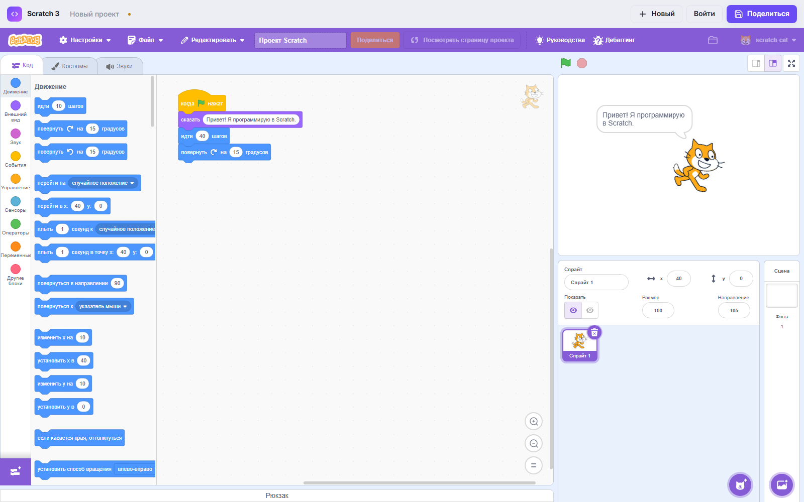

### Редактор костюмов

Вкладка **Костюмы** открывает редактор графики спрайта. Костюмы и звуки входят в сохраняемый проект `.sb3`.
Файл можно также сохранить на компьютер через меню самого Scratch;
сохранённый в сервисе проект доступен для скачивания через `/s/<id>/zip/` как `project.sb3`.

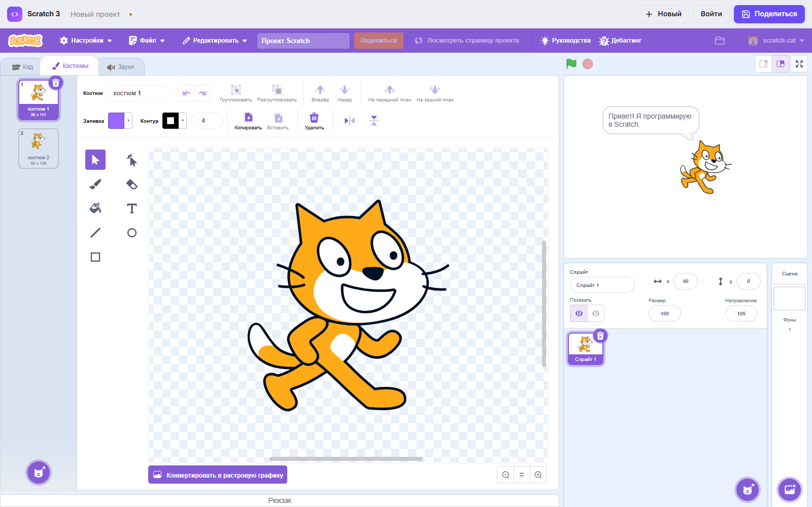

### Blockly → Python

Выбери **Блоки**, чтобы собирать программу без сцены: переменные, условия, циклы, функции и ввод-вывод.
Рядом виден сгенерированный Python; его просмотр можно скрыть кнопкой **Код**.
Программа выполняется в обычной интерактивной консоли, поэтому может спрашивать данные у пользователя.
При сохранении проекта сохраняются и исходные блоки, и Python-код.

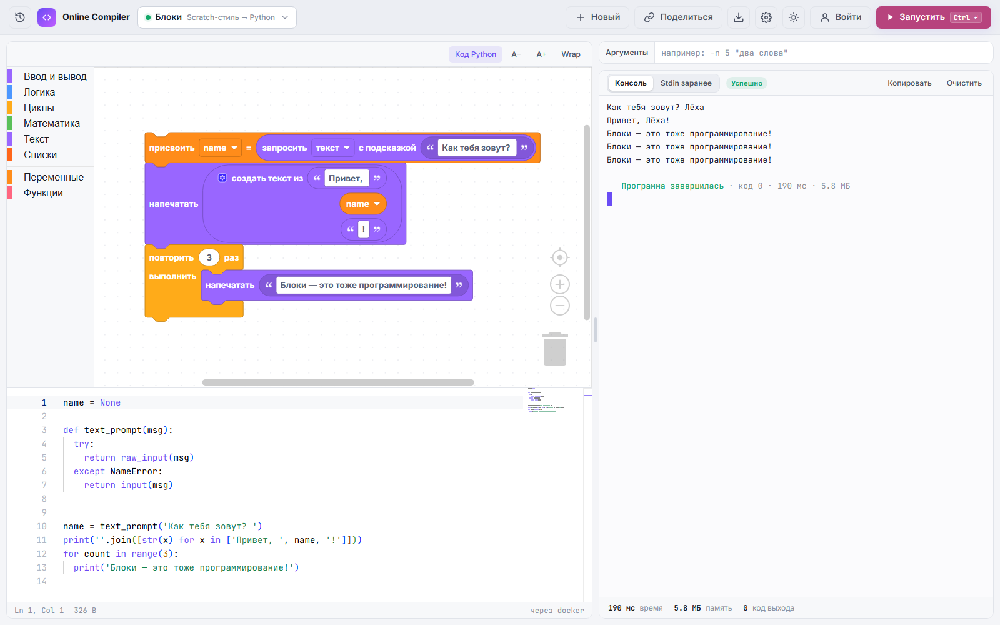

## Arduino Uno

**Arduino Uno** в меню открывает `/arduino/`: собственный Arduino CLI собирает скетч без стороннего API,
а открытая библиотека [AVR8js](https://github.com/wokwi/avr8js) исполняет прошивку ATmega328P в браузере.
Справа — **схема**: плата и детали, которые ты сам добавляешь из палитры и подключаешь к ножкам.
Есть примеры (скетч + схема), Serial, скачивание .ino, черновик и сохранение проекта со схемой по ссылке или в аккаунт.
Сборщик: `python manage.py build_sandbox arduino`.

### Схема с деталями

1. **＋ Деталь** открывает палитру с картинками: выходы, моторы, дисплеи, кнопки и ручки, датчики, пульты.
2. Клик по детали добавляет её на схему и сразу раздаёт свободные подходящие ножки (ШИМ, АЦП, прерывание, I2C).
3. Детали перетаскиваются мышью или пальцем; провода от ножек платы рисуются сами.
4. Клик по детали — настройки: ножки (занятые подписаны), цвет и тип, кнопка **Вставить пример кода**
   с уже выбранными ножками и **Удалить**.
5. **Собрать и запустить** — детали оживают: светятся, крутятся, пищат, показывают текст; кнопки, ручки,
   датчики и пульты подают сигналы прямо на ножки эмулируемого процессора.

Схема хранится в проекте файлом `diagram.json` (как в Wokwi), черновик — в браузере.

| Группа | Детали | Как работает в эмуляторе |
|---|---|---|
| Выходы | светодиод (6 цветов), RGB-светодиод, NeoPixel WS2812 (лента 8, кольцо 16, матрица 8×8), пищалка (пассивная/активная), реле с лампой | яркость по ШИМ; NeoPixel — по длительности импульсов (0.35/0.7 мкс), как настоящая лента; пищалка звучит через WebAudio на частоте `tone()` |
| Моторы | сервопривод SG90, DC-мотор, мотор + драйвер L298N, шаговый 28BYJ-48 + ULN2003 | угол — по ширине импульса 544…2400 мкс; скорость — по скважности ШИМ; шаговик считает шаги по порядку обмоток |
| Дисплеи | 7-сегментный индикатор, LCD 16×2, LCD 16×2 I2C (PCF8574), OLED 128×64 SSD1306 | HD44780 в 4-битном режиме; I2C — через эмуляцию TWI, OLED рисует буфер кадра |
| Кнопки и ручки | кнопка (к GND или +5V), переключатель, потенциометр, джойстик, клавиатура 4×4 | клавиатура замыкает строку и столбец — библиотека Keypad опрашивает её как настоящую |
| Датчики | фоторезистор, TMP36, PIR, ИК-датчик препятствия, дальномер HC-SR04, DHT22 | HC-SR04 отвечает эхо-импульсом 58 мкс/см; DHT22 — 40 битами на стартовый импульс |
| Пульты | ИК-приёмник + пульт на 21 кнопку, радиопульт 433 МГц на 4 кнопки | кнопка пульта подаёт на ножку настоящий сигнал NEC (IRremote) или RCSwitch (протокол 1, 24 бита) |

В образе есть библиотеки Servo, LiquidCrystal, LiquidCrystal I2C, Stepper, Keypad, IRremote, rc-switch,
Adafruit NeoPixel, Adafruit SSD1306 + GFX, DHT sensor library. Время на плате считается по тактам процессора,
поэтому длительности импульсов точные; скорость эмуляции зависит от браузера и компьютера.

| Пример | Что на схеме |
|---|---|
| Мигающий светодиод, Кнопка и светодиод, Потенциометр и яркость, Сервопривод, LCD 16×2 | базовые уроки |
| Светофор с пищалкой | три светодиода и `tone()` |
| NeoPixel: радуга на кольце | кольцо WS2812 на D6 |
| ИК-пульт управляет светодиодами | кнопки 1–3 пульта переключают светодиоды |
| Парктроник | HC-SR04 + пищалка: чем ближе, тем чаще пищит |
| Метеостанция | DHT22 + OLED по I2C |

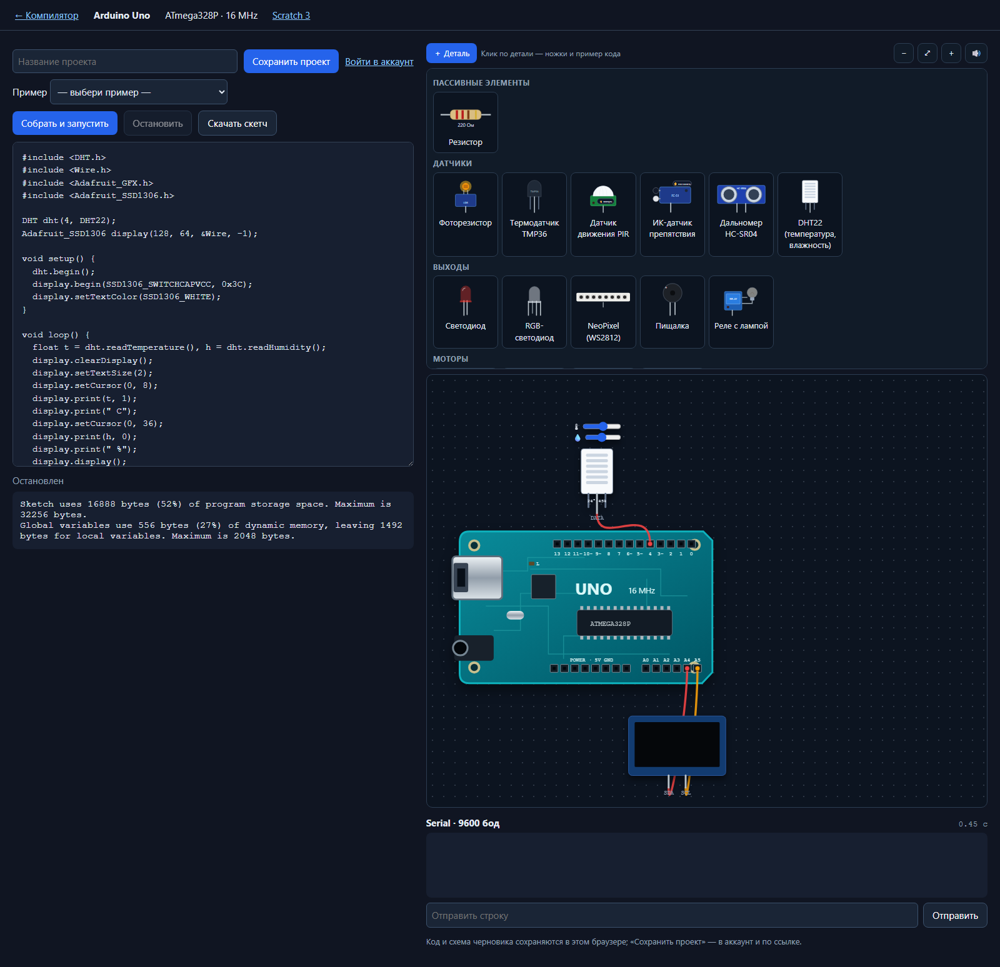

| Мигалка и Serial | Сервопривод |
|---|---|
| 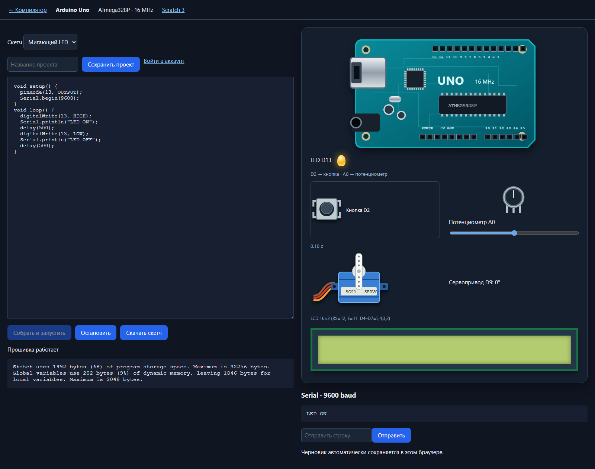 | 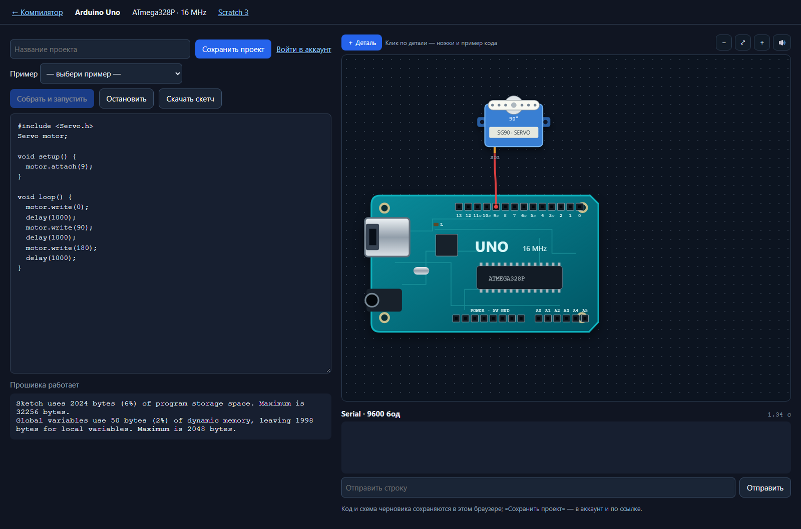 |
| **NeoPixel** | **ИК-пульт** |
| 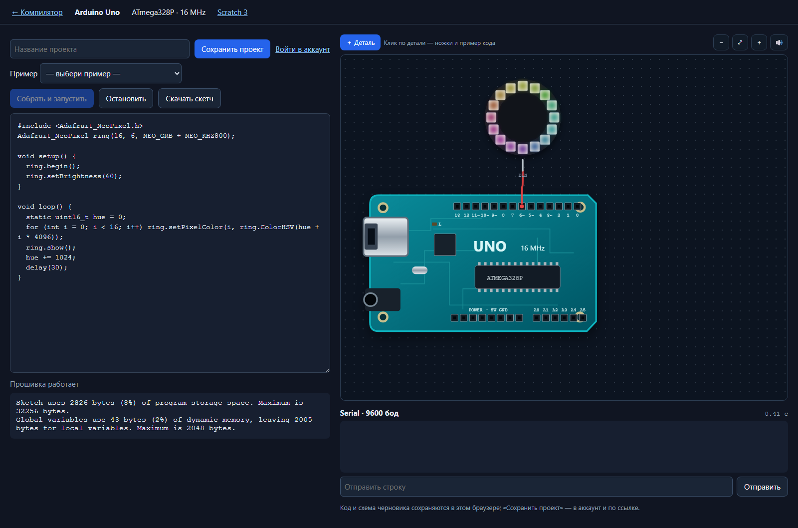 | 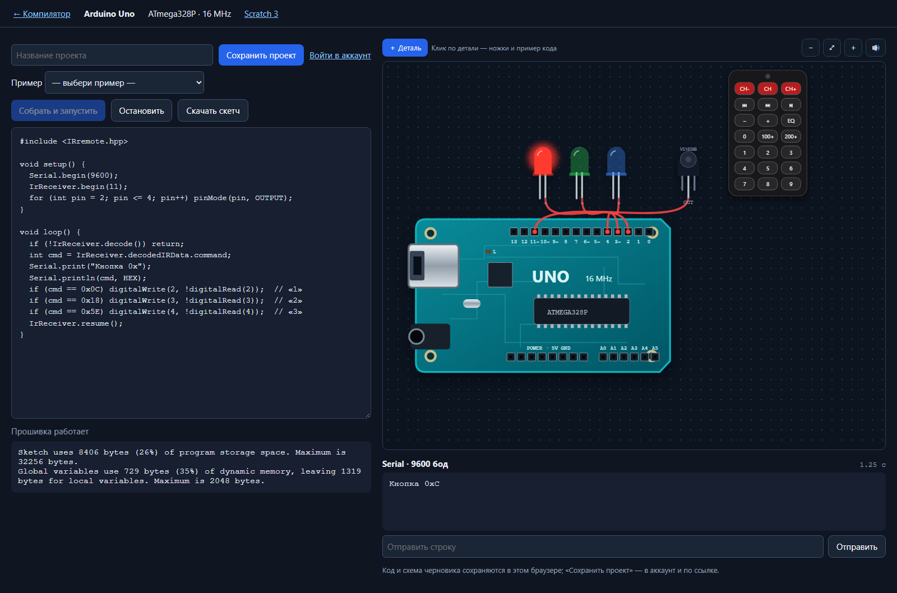 |
| **Метеостанция: DHT22 + OLED** | **LCD 16×2** |
| 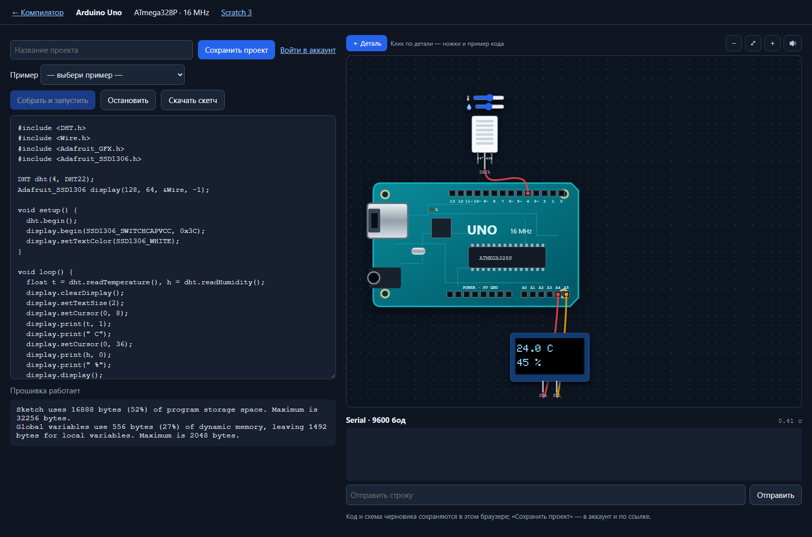 | 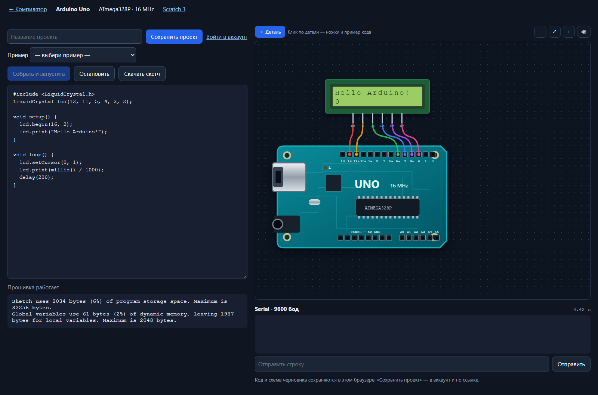 |

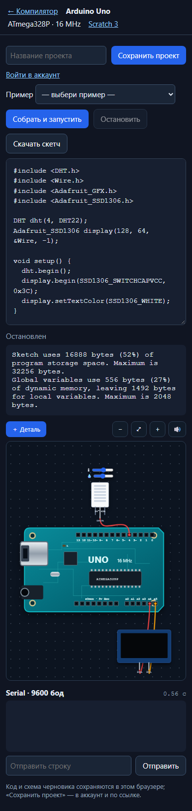

## ESP32 и сайт внутри прошивки

**ESP32 · Serial** использует собственный образ ESP-IDF 5.4 и QEMU Espressif.
Сборщик: `python manage.py build_sandbox esp32`. Первая сборка образа скачивает несколько ГБ.
Выбирай интерактивную консоль. Шаблон запускает HTTP-сервер внутри прошивки;
после получения IP в Serial нажми **Открыть сайт ESP32**. Страница существует, пока работает сессия.
ESP-IDF уже собран в образе: при запуске пересобираются только твои файлы (около двух минут).

### Запуск веб-сервера

1. На главной странице выбери **ESP32 · Serial**.
2. Оставь стартовый шаблон или открой **Примеры → Сайт ESP32 в эмуляторе**.
3. Запусти программу. Для ESP32 редактор использует интерактивную консоль.
4. Дождись сообщения `ESP32 HTTP ready` с IP-адресом в Serial.
5. Нажми **Открыть сайт ESP32**. Откроется HTML, который обслуживает HTTP-сервер самой прошивки.
6. После остановки программы ссылка перестаёт работать: веб-сервер принадлежит конкретной сессии.

В примере обработчик `home()` задаёт HTML страницы, а `httpd_register_uri_handler()` регистрирует маршрут `/`.
Можно изменить страницу и добавить GET-маршруты для данных или управления.
Используй относительные ссылки, чтобы запросы проходили через адрес текущей сессии.

По текущей конфигурации на компиляцию ESP32 выделено до 600 секунд, контейнеру — 2 ГБ памяти и 2 CPU.
Исполнение ограничено общими лимитами консоли и 120 секундами CPU-времени.

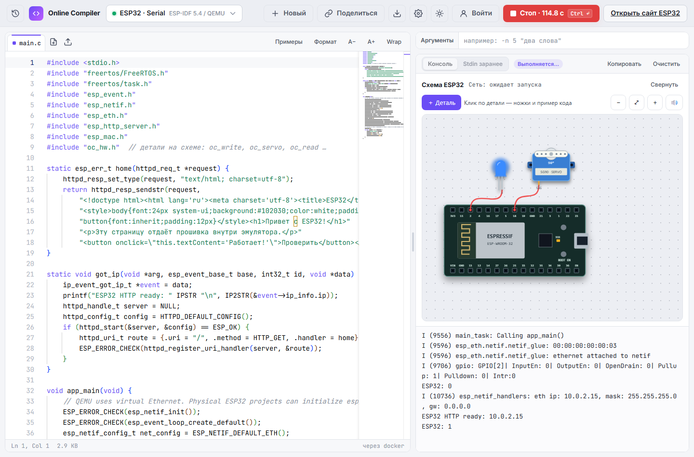
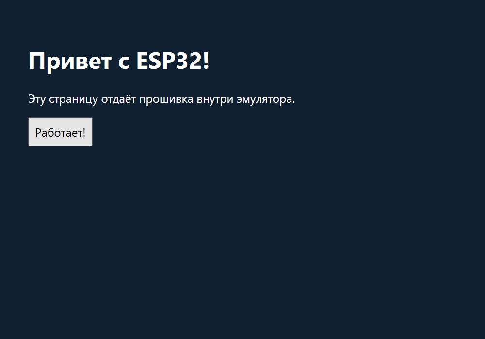

QEMU поддерживает виртуальный Ethernet OpenETH, но не Wi-Fi радио ESP32:
это сетевой режим эмулятора. Пример для настоящего Wi-Fi на физической плате находится в
`compiler/engine/sandbox/esp32/main/wifi_hardware.c.example`.
HTTP передаётся через локальный мост в сессию; контейнер остаётся без внешней сети.
Для ссылок и ресурсов внутри сайта используй относительные URL: `style.css`, `status?mode=on`.
Описание сетевых возможностей: [документация Espressif QEMU](https://github.com/espressif/esp-toolchain-docs/blob/main/qemu/esp32/README.md).

### Эмулятор и физическая плата

| Возможность | Эмулятор ESP32 | Физическая ESP32 |
|---|---|---|
| Serial и выполнение ESP-IDF кода | QEMU | реальный микроконтроллер |
| HTTP-сервер | виртуальный Ethernet OpenETH и ссылка сессии | через Wi-Fi вашей сети |
| Wi-Fi радио | не эмулируется | поддерживается оборудованием |
| Детали на схеме | GPIO, LEDC и АЦП через мост `oc_hw.c` (перехват линкером) | внешние компоненты подключаются к GPIO |

Пример **Wi-Fi и сайт на настоящей ESP32** предназначен для прошивки физической платы:
замени `YOUR_SSID` и `YOUR_PASSWORD` своими данными и используй обычный процесс сборки/прошивки ESP-IDF.
В QEMU этот вариант не подключится к беспроводной сети.

## Аккаунты и сохранение проектов

Регистрация и вход находятся в верхней панели основного редактора.
Почту можно указать при регистрации или добавить в настройках аккаунта для восстановления пароля.

| Действие | Без аккаунта | В аккаунте |
|---|---|---|
| Запуск программ, блоков и симуляторов | доступен | доступен |
| Сохранение | анонимная неизменяемая ссылка | собственный проект в «Моих проектах» |
| Повторное сохранение | новая копия по ссылке | обновление своего проекта с прежним адресом |
| Чужой проект | просмотр по доступной ссылке | можно сделать форк |
| История запусков | текущая сессия браузера | привязана к пользователю |

В основном редакторе `Ctrl+S` сохраняет проект. В Scratch работает верхняя кнопка и `Ctrl+S`;
в Arduino используй **Сохранить проект**. Ссылки Scratch имеют вид `/scratch/<id>/`, Arduino — `/arduino/<id>/`.
Все эти типы проектов появляются в общем списке аккаунта.

**Видимость:** публичный проект показывается в профиле `/u/<имя>/`, проект «по ссылке» не попадает в публичный список,
приватный доступен только владельцу. Права на чтение проверяются и в API.

Регистрация поддерживает email, восстановление пароля, публичные профили и видимость проектов.
Для GitHub/Google OAuth заполни ключи провайдеров из `.env.example`; для отправки писем настрой SMTP.
Без SMTP ссылка восстановления выводится в консоль сервера.

## Скриншоты и их обновление

Новые изображения лежат в `docs/screenshots/`. Это снимки работающего интерфейса и прошивок, а не макеты.
Для повторной съёмки установи Playwright в окружение, где запускаешь команды:

```powershell
python -m pip install -r requirements-dev.txt
python -m playwright install chromium
python e2e\screenshots_hardware.py http://127.0.0.1:8000  # Scratch, костюмы, Blockly, схема Uno с деталями
python e2e\test_esp32.py http://127.0.0.1:8000            # сборка ESP32, сайт и скриншоты
python e2e\test_circuit.py http://127.0.0.1:8000          # схема Arduino, в т.ч. на телефоне
```

Перед съёмкой запусти Django, PostgreSQL и Docker; собери Scratch и соответствующие образы плат.
Для основного редактора, отладчика и аккаунтов есть отдельный `e2e/screenshots.py`.

## Если что-то не запускается

| Что видно | Что проверить |
|---|---|
| Scratch предлагает команду сборки | выполни `manage.py build_scratch`, затем обнови страницу |
| Arduino сообщает, что сборщик недоступен | запусти Docker Desktop и `manage.py build_sandbox arduino` |
| Язык в меню недоступен | посмотри `manage.py engine_status`; скачай официальный образ или собери свой через `build_sandbox` |
| ESP32 долго пишет строки компиляции | дождись сборки ESP-IDF; не останавливай сессию до сообщения о запуске |
| Сайт ESP32 ещё не готов | дождись `ESP32 HTTP ready` и обнови страницу сайта |
| Ссылка ESP32 сообщает о завершённой сессии | снова запусти прошивку и открой новую ссылку из редактора |
| Письмо восстановления не пришло | без SMTP оно выводится в консоль; для реальной отправки настрой `EMAIL_HOST` и учётные данные |
| Браузер не соединяется с консолью | используй ASGI-сервер и разреши WebSocket в прокси |

В публичной установке предварительно собери редактор и образы: посетителю нужны готовые режимы,
а не доступ к командам администратора сервера.

## Прод

`DJANGO_DEBUG=false`, свой `DJANGO_SECRET_KEY` и `DJANGO_ALLOWED_HOSTS`, `manage.py collectstatic`,
ASGI-сервер (`daphne config.asgi:application` — нужен для WebSocket-консоли), `EXECUTOR_BACKEND=docker`, `REDIS_URL`
(без Redis rate limit и кеш у каждого воркера свои).

К базе — через пул psycopg (`DB_POOL_SIZE`, по умолчанию 10) с `CONN_MAX_AGE = 0`: под ASGI «постоянные» соединения
утекают по одному на поток, пока PostgreSQL не упрётся в `max_connections`. Не включай `CONN_MAX_AGE` обратно.


## Примеры алгоритмов на разных языках

Один бинарный поиск запущен на шести языках; на снимках видны исходники и результат.

| Python | C++ |
|---|---|
| 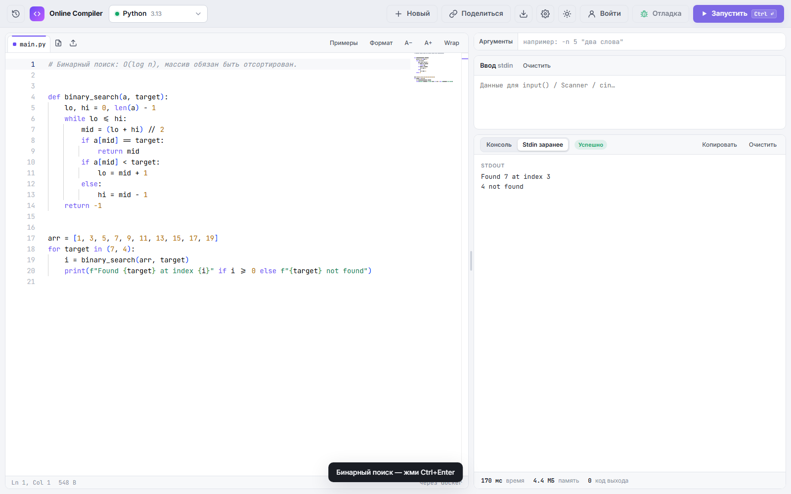 | 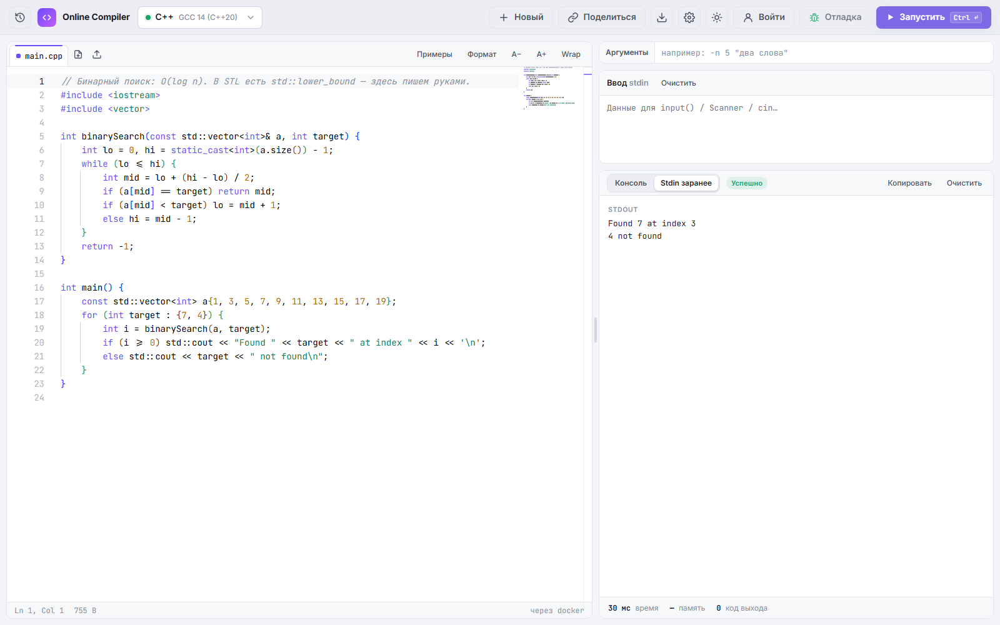 |
| Java | Go |
| 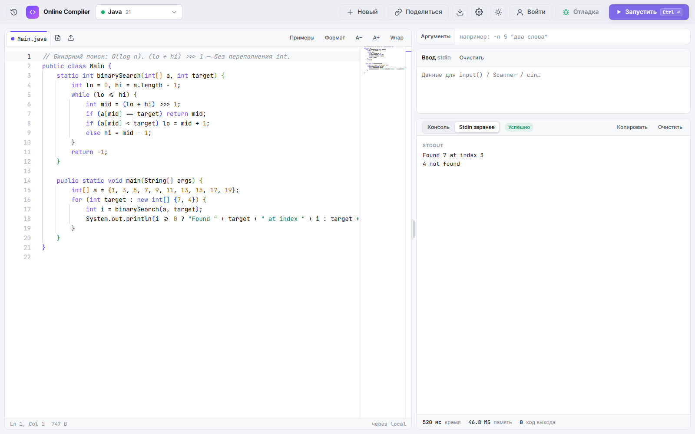 | 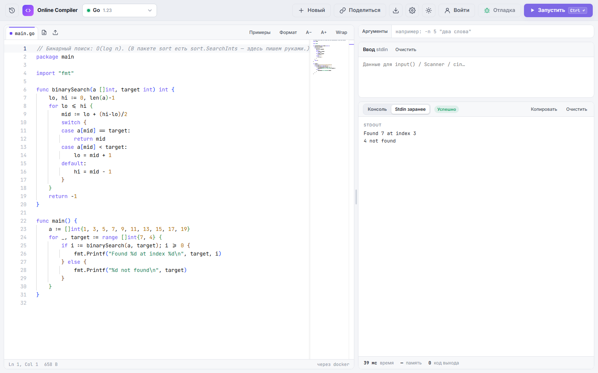 |
| Rust | SQL |
| 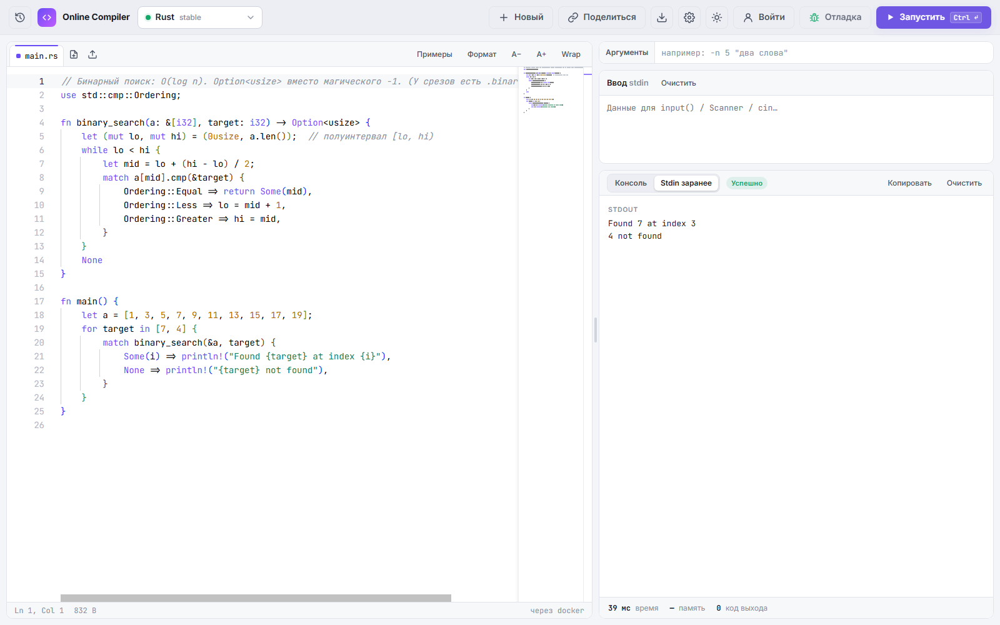 | 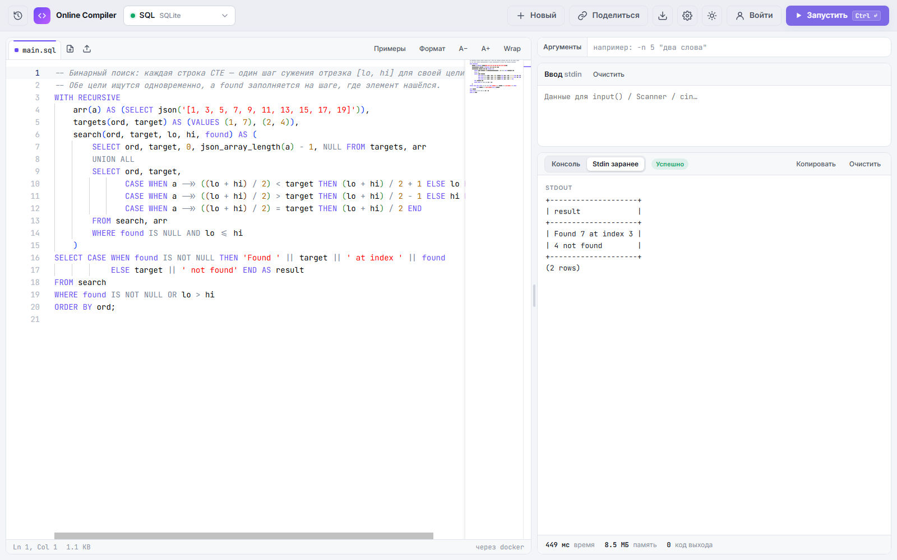 |

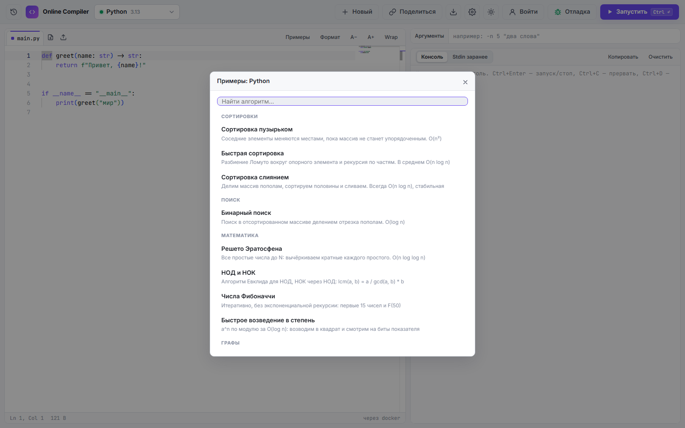

## Схема ESP32

У ESP32 в редакторе над консолью та же схема с деталями (плата DevKit, ножки GPIO). QEMU не выводит ножки
наружу, поэтому к каждому проекту добавляется мост `main/oc_hw.c`: линкер (`ld --wrap`) подменяет
`gpio_set_level`, `gpio_get_level`, `ledc_*` и `adc_oneshot_*`. Обычный код ESP-IDF сам двигает детали,
а кнопки, ручки и датчики со схемы приходят в прошивку через UART. Служебные строки в консоли не видны.

```c
#include "oc_hw.h"   // короткие обёртки над ESP-IDF — на настоящей плате работают так же

void app_main(void) {
    oc_output(2);
    oc_input(4, true);                       // кнопка к GND
    while (1) {
        oc_write(2, oc_read(4) == 0);         // светодиод горит, пока кнопка нажата
        oc_servo(18, oc_analog_mv(34) * 180 / 3300);  // потенциометр крутит серво
        oc_delay(20);
    }
}
```

| Детали | В эмуляторе ESP32 |
|---|---|
| светодиоды, RGB, пищалка, реле, моторы, серво, шаговик, 7-сегментный, кнопки, переключатель, клавиатура, PIR, ИК-датчик препятствия | обычные GPIO и LEDC (`gpio_set_level`, `ledc_set_duty`…) или `oc_write`, `oc_pwm`, `oc_servo`, `oc_tone` |
| потенциометр, фоторезистор, TMP36, джойстик | АЦП1 (GPIO 32–39): `adc_oneshot_read` или `oc_analog_mv` |
| LCD 16×2, NeoPixel, HC-SR04, DHT22, ИК-пульт, радиопульт | функции `oc_lcd_print`, `oc_neopixel_show`, `oc_distance_cm`, `oc_dht_read`, `oc_ir_read`, `oc_rf_read` — их протоколы требуют тайминга железа (RMT, I2C), которого в QEMU нет |
| OLED SSD1306 | только Arduino |

**Вставить пример кода** в настройках детали подставляет готовый `main.c` с выбранными ножками.
Схема сохраняется в проекте файлом `diagram.json`.

Протокол моста (если пишешь без `oc_hw.h`): прошивка печатает `@OC D <gpio> <0|1>`, `@OC P <gpio> <скважность‱> <Гц>`,
`@OC LCD <кол> <стр> <текст>`, `@OC NEO <gpio> <RRGGBB…>`; схема отвечает `@IN D <gpio> <0|1>`, `@IN A <gpio> <мВ>`,
`@IN IR <код>` и т.д. (полный список — в начале `oc_hw.c`).

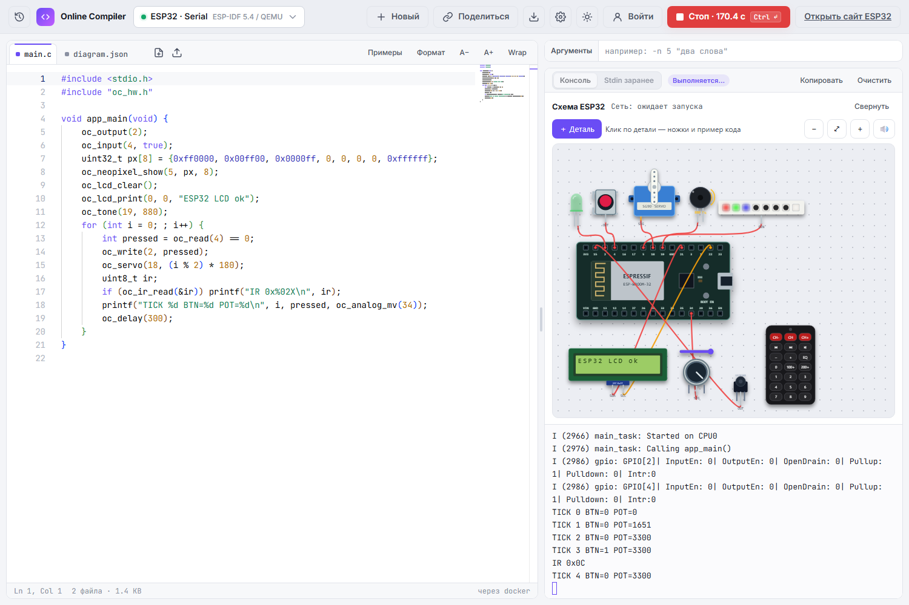
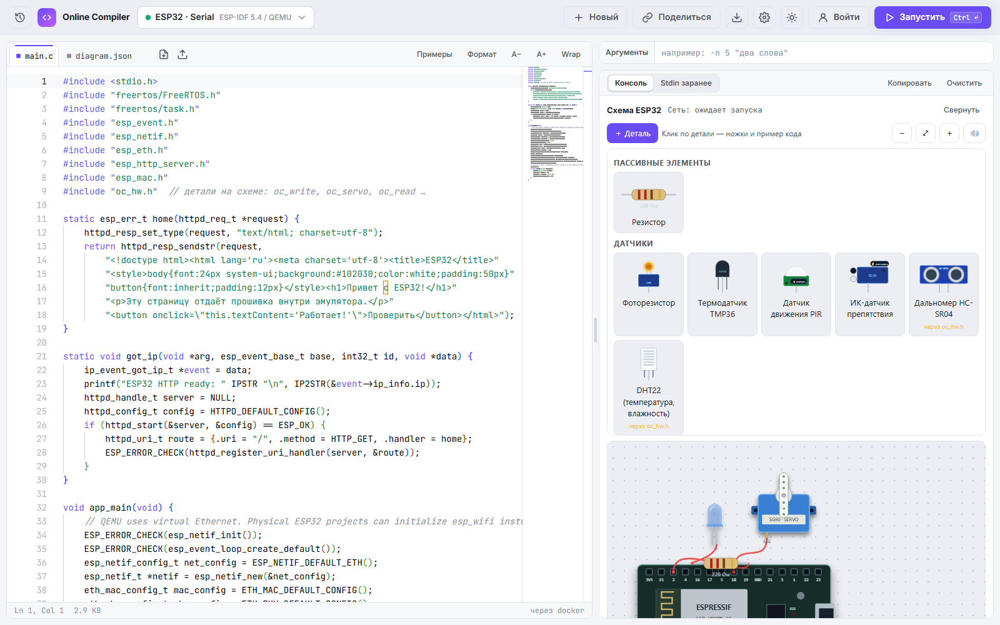
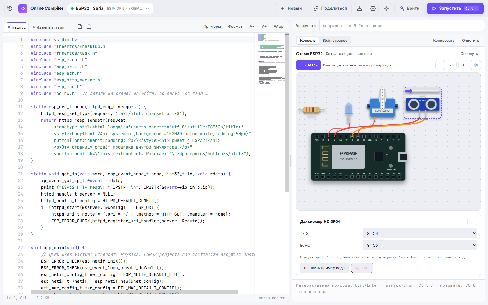
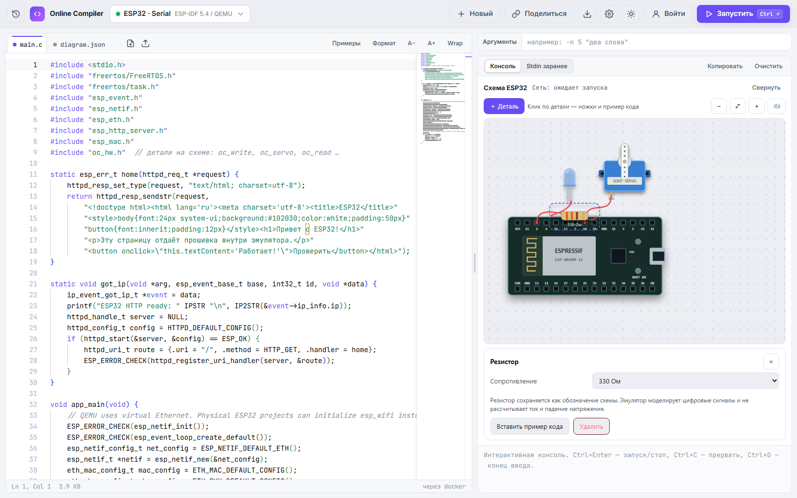
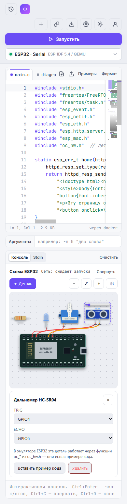

Резистор можно добавить на схему и выбрать номинал (100 Ом — 10 кОм).
Это обозначение, сохраняемое в `diagram.json`: расчёт тока и падения напряжения пока не поддерживается.
На демонстрационных схемах обычные светодиоды подключены через обозначенные последовательные резисторы 220 Ом;
их соединение со светодиодом сохраняется вместе со схемой. Модули NeoPixel имеют встроенный драйвер светодиодов.
HC-SR04 находится в категории «Датчики»; расстояние задаётся ползунком и читается через `oc_distance_cm`.
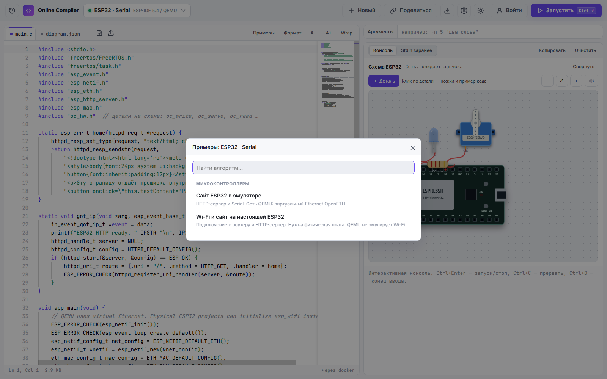
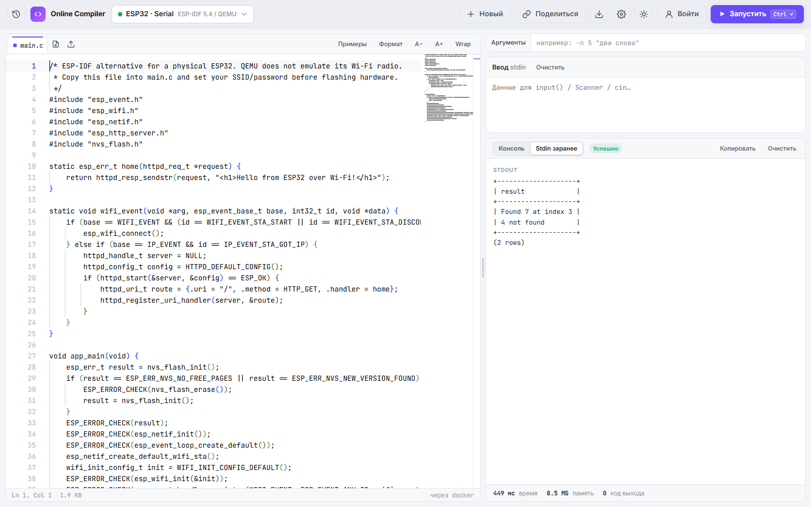

Снимки сниппетов обновляются командой `python e2e/screenshots_snippets.py http://127.0.0.1:8000`.

Проверка схемы ESP32: `python e2e/test_esp32_components.py` (секунды) или с `--qemu` — с настоящей прошивкой (~3 мин).

Последняя локальная проверка (02.10.2026): интерфейс схемы и сохранение проектов проходят тесты.
При повторной съёмке демонстрационной прошивки QEMU остановился на строке `Multicore bootloader`
и завершился по лимиту CPU. Скриншоты палитры, настроек и мобильного вида обновлены;
новая работающая демонстрация прошивки пока не подтверждена.
