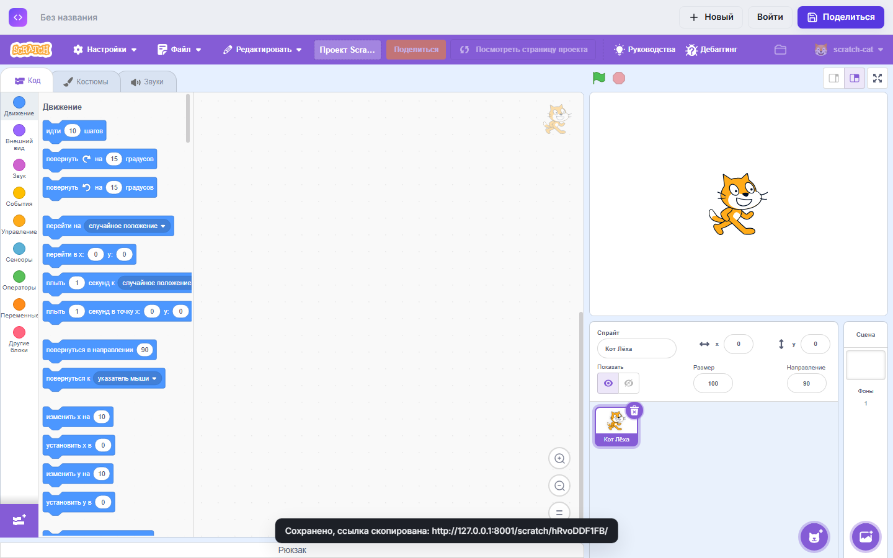
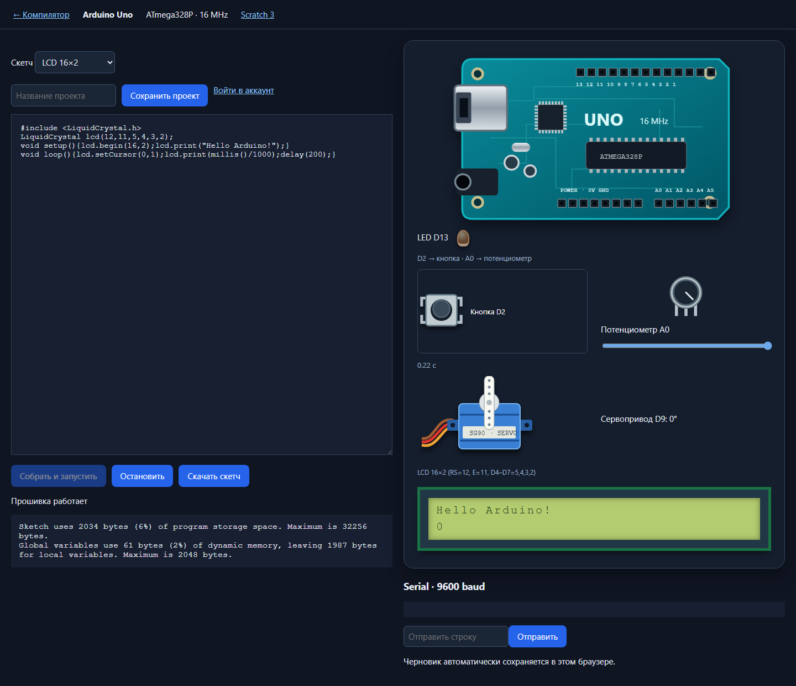

# Online Compiler

Онлайн-компилятор на Django + PostgreSQL с собственным движком исполнения (без Judge0, Piston и прочих готовых API).


- **41 язык**: Python, JavaScript, TypeScript, C, C++, Java, C#, Go, Rust, Kotlin, Ruby, PHP, Perl, Lua, Bash, Haskell,
  Swift, R, Dart, Elixir, SQL (SQLite), Pascal, Fortran, Assembly (NASM x86-64), Prolog, Visual Basic .NET, Objective-C,
  Scala, F#, OCaml, Erlang, Clojure, Julia, Zig, Nim, Crystal, D, COBOL, Ada, Common Lisp, Groovy
- **Библиотека алгоритмов** — кнопка «Примеры»: 15 задач (сортировки, бинарный поиск, решето, НОД, Фибоначчи,
  быстрое возведение в степень, BFS, DFS, Дейкстра, LCS, рюкзак, Ханойские башни) на **каждом** из 41 языка —
  615 сниппетов, и каждый автоматически сверяется с эталонным выводом
- **Monaco Editor** (движок VS Code): подсветка, автодополнение, мини-карта, sticky scroll
- **Blockly и Scratch 3**: блоки → Python либо полный редактор со сценой, спрайтами и сохранением .sb3
- **Arduino Uno и ESP32**: настоящая сборка прошивок, визуальные компоненты Uno, Serial и сайт на ESP32 в QEMU
- Ошибки компилятора/трейсбеки подсвечиваются **прямо в коде**, а `main.c:12` в выводе — кликабельная ссылка на строку
- stdin, история запусков (по сессии), шаринг по короткой ссылке `/s/<id>/`, тёмная и светлая тема, черновики по языкам, ресайз панелей, мобильная вёрстка
- **Интерактивная консоль** как в OnlineGDB: программа спрашивает — ты отвечаешь прямо в терминале (xterm.js + WebSocket).
  В Docker программа работает в настоящем PTY: приглашения без `\n` видны сразу, `Ctrl+C` — SIGINT, `Ctrl+D` — конец ввода.
  Режим «Stdin заранее» (stdout/stderr раздельно) тоже остался
- **Отладчик** для 7 языков: брейкпоинты, шаги, стек, переменные, watch, значения при наведении
- **Мультифайловые проекты**: вкладки, новый файл (`Alt+N`), переименование двойным кликом, загрузка с диска и drag&drop
- **Аргументы командной строки** (`argv`, `sys.argv`, `os.Args`…) — строкой как в шелле, работают и в консоли, и в отладчике
- **Beautify** (`Shift+Alt+F`): настоящие форматтеры в браузере через WASM — ruff (Python), clang-format
  (C/C++/Java/C#), biome (JS/TS), gofmt, sql, lua, shfmt, dart; Rust (`rustfmt`) и Elixir (`mix format`) — на сервере в песочнице
- **Скачать проект** одним `.zip` (и `/s/<id>/zip/` для сниппета)
- **Настройки редактора**: раскладка Vim / Emacs, пробелы или табы, ширина отступа, шрифт, перенос, миникарта, стиль clang-format
- **Аккаунты и «Мои проекты»**: регистрация, вход; `Ctrl+S` сохраняет свой проект на месте (ссылка не меняется),
  чужой — форкает к тебе вместе с твоими правками; поиск, переименование, удаление; история запусков — общая для всех
  устройств. Без аккаунта всё работает как раньше: `Ctrl+S` даёт анонимную неизменяемую ссылку
- Горячие клавиши: `Ctrl+Enter` — запуск / стоп, `Ctrl+S` — сохранить / поделиться, `Shift+Alt+F` — форматировать

## Скриншоты

**Отладчик** — брейкпоинт в цикле, стек вызовов, локальные переменные и watch-выражение (C через gdbserver + GDB DAP):


**Мультифайловый проект и ошибки в коде** — ошибка компилятора подчёркнута прямо в строке, `main.cpp:6:49` в выводе
кликабельна; светлая тема и режим «Stdin заранее»:


**Beautify, аргументы командной строки и Vim** — Rust отформатирован `rustfmt`, аргументы ушли в `std::env::args()`,
внизу строка режима Vim:


**«Мои проекты»** — проект в шапке, поиск по своим проектам:


| Настройки редактора | Телефон |
|---|---|
|  |  |

Скриншоты снимаются автоматически: `python e2e\screenshots.py` (нужны запущенный сервер, Docker и `build_sandbox`).

## Быстрый старт

Двойной клик по **`start.bat`** — он сам создаст venv, поставит зависимости, накатит миграции, разбудит Docker
и откроет браузер (`start.bat 9000` — другой порт). Вручную:

```powershell
python -m venv .venv
.\.venv\Scripts\pip install -r requirements.txt
copy .env.example .env          # впиши DB_PASSWORD и DJANGO_SECRET_KEY
.\.venv\Scripts\python manage.py migrate
.\.venv\Scripts\python manage.py pull_images   # официальные образы языков (выборочно: pull_images python cpp go)
.\.venv\Scripts\python manage.py build_sandbox # свои образы: языки oc-lang-* (Pascal, COBOL, Zig, Scala…),
                                               # отладчики oc-debug-* и хелперы консоли (несколько ГБ)
.\.venv\Scripts\python manage.py runserver
```

Открой http://127.0.0.1:8000. Админка — `/admin/` (сначала `manage.py createsuperuser`).

`manage.py engine_status` показывает, какой язык через какой бэкенд пойдёт.

## Как устроен движок (`compiler/engine/`)

| Файл | Что делает |
|---|---|
| `languages.py` | Реестр языков: имя файла, шаблон, команды сборки/запуска для Docker и для хоста |
| `docker.py` | Песочница: одноразовый контейнер на запуск |
| `local.py` | Запуск тулчейнами хоста (для разработки) |
| `process.py` | Процесс с лимитами: время, память, вывод, число процессов |
| `__init__.py` | Выбор бэкенда, валидация, ограничение параллельных запусков |
| `sandbox/lang/*.Dockerfile` | Свои образы языков: `extra` (Pascal, Fortran, NASM, Prolog, COBOL, Ada, Objective-C, Lisp, OCaml, D, Zig), `jvm` (Scala, Clojure) |

Библиотека алгоритмов — `compiler/library/`: код в `code/<язык>/<задача>.<расширение>`, эталонные выводы — в
`expected.json`, один на все языки. `manage.py check_library [языки] [--algo задача]` запускает сниппеты в песочнице
и сверяет вывод (у SQL — ячейки результата, а не рамки таблицы).

**Docker-бэкенд** (`EXECUTOR_BACKEND=docker`, или `auto`, если демон запущен): `--network none`, read-only rootfs,
`--cap-drop ALL`, `no-new-privileges`, пользователь `nobody`, лимиты памяти/CPU/pids/файлов, `timeout -s KILL`
внутри контейнера. Время и пиковая память замеряются внутри контейнера, без учёта старта Docker.

**Локальный бэкенд** (`EXECUTOR_BACKEND=local`, или `auto`, если образа нет, а тулчейн есть): на Windows процесс
стартует приостановленным и попадает в Job Object (лимит памяти, лимит процессов, убийство всего дерева), на Linux —
через rlimit и группу процессов. **Это не песочница**: у кода есть доступ к файлам и сети хоста. Для публичного
доступа используй только `EXECUTOR_BACKEND=docker`.

Новый язык добавляется одной записью `Language(...)` в `languages.py`.

## Настройки (`.env`)

| Переменная | По умолчанию | |
|---|---|---|
| `EXECUTOR_BACKEND` | `auto` | `auto` / `docker` / `local` |
| `EXECUTOR_RUN_TIMEOUT` | `10` | секунды на выполнение |
| `EXECUTOR_COMPILE_TIMEOUT` | `30` | секунды на компиляцию |
| `EXECUTOR_MEMORY_MB` | `512` | лимит памяти (у JVM/.NET/GHC в Docker свой, выше) |
| `EXECUTOR_MAX_CONCURRENT` | `4` | одновременных запусков на процесс |
| `EXECUTOR_RATE_LIMIT_PER_MINUTE` | `30` | запусков с одного IP в минуту, `0` — без лимита |
| `EXECUTOR_INTERACTIVE_TIMEOUT` | `300` | сколько живёт сессия консоли (ожидание ввода не тратит CPU-лимит) |
| `EXECUTOR_MAX_INTERACTIVE_SESSIONS` | `8` | одновременных сессий консоли |

## API

| Метод | URL | |
|---|---|---|
| GET | `/api/languages/` | языки и их доступность |
| POST | `/api/run/` | `{language, code, files, stdin, args}` → `{status, stdout, stderr, compile_output, time_ms, memory_kb, exit_code, ...}` |
| POST | `/api/snippets/` | сохранить проект, вернуть короткую ссылку (залогиненному — в «Мои проекты») |
| GET | `/api/snippets/<id>/`, `/s/<id>/raw/` | получить проект |
| PATCH, DELETE | `/api/snippets/<id>/` | сохранить на месте / переименовать (`{title}`) / удалить — только владелец |
| POST | `/api/snippets/<id>/fork/` | форк в свои проекты |
| GET | `/api/projects/?q=` | «Мои проекты» |
| POST | `/api/auth/register/`, `/api/auth/login/`, `/api/auth/logout/`; GET `/api/auth/me/` | аккаунт (`{username, password}`) |
| GET | `/api/history/`, `/api/executions/<id>/` | история текущей сессии |
| POST | `/api/format/` | `{language, code}` → `{code}` — только Rust и Elixir, остальные форматируются в браузере |
| POST | `/api/zip/` | `{language, code, files}` → архив проекта; для сниппета — GET `/s/<id>/zip/` |

WebSocket `/ws/run/` — консоль: `{"type": "start", language, code, files}`, затем `stdin` / `eof` / `interrupt` / `kill`;
сервер шлёт `phase`, `output` (`compile` / `stdout` / `stderr`) и `exit`.

Статусы: `ok`, `stopped`, `compile_error`, `runtime_error`, `timeout`, `memory_limit`, `output_limit`, `unavailable`, `internal_error`.

## Отладчик

Кнопка **Отладка** (или `F5`): брейкпоинты кликом слева от номера строки (`F9` — на строке курсора), `F10` / `F11` /
`Shift+F11` — шаги, `F6` — пауза, `Shift+F5` — стоп. Справа — стек вызовов (клик по кадру — переход), дерево
переменных, watch-выражения; наведение мышкой на переменную во время паузы показывает её значение. Ввод-вывод
программы при отладке идёт в ту же консоль.

| Язык | Отладчик | Где |
|---|---|---|
| Python | debugpy | Docker, локально (`pip install debugpy`) |
| C, C++, Rust | gdbserver + GDB 16 (встроенный DAP) | Docker |
| Go | delve | Docker |
| Java, Kotlin | собственный адаптер `OcJdiAdapter` на JDI | Docker, локально Java (нужен JDK) |

Сервер говорит с отладчиками по Debug Adapter Protocol (`compiler/engine/dap.py`, `debugger.py`); в контейнер
DAP идёт через `docker exec`, сеть контейнеру по-прежнему не нужна. Образы отладчиков собирает
`manage.py build_sandbox` (несколько ГБ, нужна сеть на время сборки; выборочно: `build_sandbox python native go jvm`).

## Тесты

```powershell
.\.venv\Scripts\python manage.py test compiler      # движок, API, консоль, отладчик (без Docker часть пропустится)
python e2e\test_ui.py                                # браузер: запуск, консоль, мультифайл, история (нужен сервер)
python e2e\test_debugger.py                          # браузер: отладка Python / C / Java
python e2e\test_tools.py                             # браузер: аргументы, Beautify, zip, настройки, Vim / Emacs
python e2e\test_accounts.py                          # браузер: регистрация, сохранение, форк, «Мои проекты»
python e2e\test_library.py                           # браузер: «Примеры», подсветка и запуск новых языков
python e2e\test_blocks.py                            # Blockly → Python
python e2e\test_scratch.py                           # Scratch: сцена, .sb3, сохранение и форки
python e2e\test_arduino.py                           # прошивка, LED, кнопка, ADC, Servo, LCD
python e2e\test_esp32.py                             # прошивка ESP32, IP и веб-сайт
.\.venv\Scripts\python manage.py check_library      # все 615 сниппетов против эталона (~30 мин)
```

В `manage.py test` библиотека проверяется на шести языках разных типов (интерпретатор, компилятор, JVM, .NET,
свой образ, SQL), а шаблон каждого из 41 языка запускается целиком; полный прогон сниппетов — `OC_LIBRARY_FULL=1`.

## Блоки и Scratch 3

В меню языков **Блоки** открывает Blockly: блоки генерируют Python, а программа запускается нашим движком.
Код и блоки сохраняются вместе с проектом. **Scratch 3** открывает отдельную сцену со спрайтами,
костюмами и звуками; проекты .sb3 сохраняются в «Мои проекты» и доступны по ссылке.
Полный редактор собирается один раз: `python manage.py build_scratch`.



## Arduino и ESP32

**Arduino Uno** в меню открывает `/arduino/`: собственный Arduino CLI собирает скетч без стороннего API,
а открытая библиотека [AVR8js](https://github.com/wokwi/avr8js) исполняет прошивку ATmega328P в браузере.
Компоненты: LED D13, кнопка D2, потенциометр A0, сервопривод D9, LCD 16×2.
Плата и компоненты нарисованы как реальные устройства: рычаг SG90 вращается от PWM,
ручка потенциометра поворачивается вместе с ползунком, кнопка нажимается, LCD показывает текст прошивки.
Есть примеры, Serial, скачивание .ino, черновик и сохранение проекта по ссылке или в аккаунт.
Сборщик: `python manage.py build_sandbox arduino`.



**ESP32 · Serial** использует собственный образ ESP-IDF 5.4 и QEMU Espressif.
Сборщик: `python manage.py build_sandbox esp32`. Первая сборка образа скачивает несколько ГБ.
Выбирай интерактивную консоль. Шаблон запускает HTTP-сервер внутри прошивки;
после получения IP в Serial нажми **Открыть сайт ESP32**. Страница существует, пока работает сессия.
Сборка ESP-IDF может занимать несколько минут.


QEMU поддерживает виртуальный Ethernet OpenETH, но не Wi-Fi радио ESP32:
это сетевой режим эмулятора. Пример для настоящего Wi-Fi на физической плате находится в
`compiler/engine/sandbox/esp32/main/wifi_hardware.c.example`.
HTTP передаётся через локальный мост в сессию; контейнер остаётся без внешней сети.
Для ссылок и ресурсов внутри сайта используй относительные URL: `style.css`, `status?mode=on`.
Описание сетевых возможностей: [документация Espressif QEMU](https://github.com/espressif/esp-toolchain-docs/blob/main/qemu/esp32/README.md).

Регистрация поддерживает email, восстановление пароля, публичные профили и видимость проектов.
Для GitHub/Google OAuth заполни ключи провайдеров из `.env.example`; для отправки писем настрой SMTP.
Без SMTP ссылка восстановления выводится в консоль сервера.

## Прод

`DJANGO_DEBUG=false`, свой `DJANGO_SECRET_KEY` и `DJANGO_ALLOWED_HOSTS`, `manage.py collectstatic`,
ASGI-сервер (`daphne config.asgi:application` — нужен для WebSocket-консоли), `EXECUTOR_BACKEND=docker`. Rate limit
(запуски и попытки входа — `AUTH_RATE_LIMIT_PER_MINUTE`, по умолчанию 20) хранится в locmem-кеше, поэтому при
нескольких воркерах подключи Redis в `CACHES`.

К базе — через пул psycopg (`DB_POOL_SIZE`, по умолчанию 10) с `CONN_MAX_AGE = 0`: под ASGI «постоянные» соединения
утекают по одному на поток, пока PostgreSQL не упрётся в `max_connections`. Не включай `CONN_MAX_AGE` обратно.
